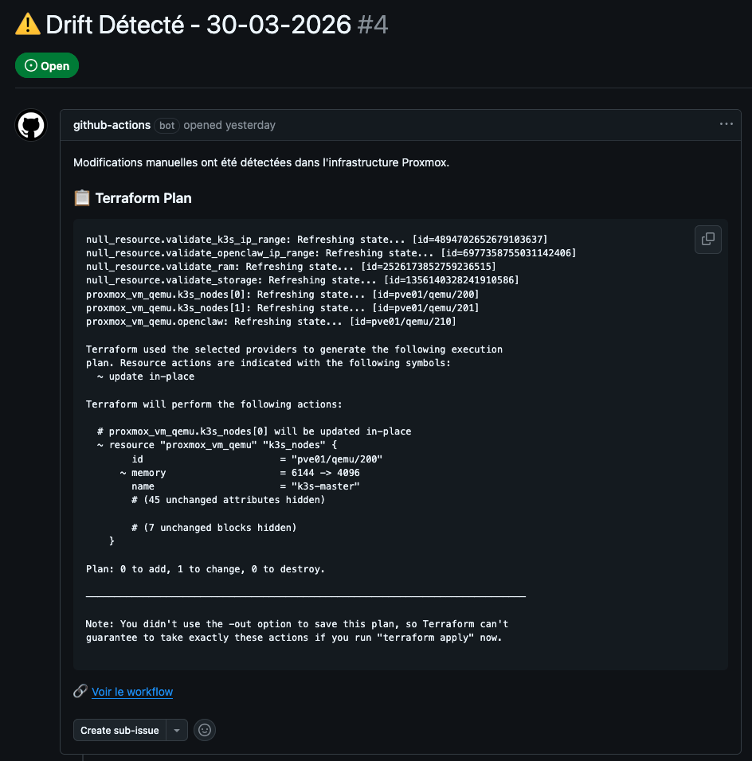

# 🚀 Utilisation des Workflows GitHub Actions

Ce document décrit les workflows github actions. Les workflows Terraform sont exécutés sur un runner self-hosted, seul point d'accès à l'infrastructure Proxmox.

- [🔒 Security Scan](#-security-scan)
- [📋 Terraform Plan](#-terraform-plan)
- [🚀 Terraform Apply](#-terraform-apply)
- [🔍 Terraform Drift Detection](#-terraform-drift-detection)
- [🗑️ Terraform Destroy](#️-terraform-destroy)

## 🔒 Security Scan

**Objectif** : Détecter les secrets en dur, les vulnérabilités et générer un rapport de sécurité.

**Déclenchement** :
- Automatique sur push vers `main` ou `develop`
- Automatique sur les Pull Requests
- Automatique tous les lundis à 2h (cron)
- Manuel via l'onglet **Actions** → **Security Scan** → **Run workflow**

**Paramètres** : Aucun

**Scans effectués** :
- **TruffleHog** : Détection de secrets dans l'historique Git
- **Gitleaks** : Détection de secrets et credentials
- **tfsec** : Analyse de sécurité Terraform (misconfigurations, best practices)
- **Checkov** : Scan de conformité et sécurité Terraform
- **Trivy** : Scan de vulnérabilités dans les configurations
- **Workflow Security** : Validation des workflows GitHub Actions

**Résultat** :
- Les vulnérabilités sont affichées dans l'onglet **Security** de GitHub
- Un rapport de sécurité est généré et disponible en artifact
- Sur les PRs, un commentaire automatique résume les résultats

## 📋 Terraform Plan

**Objectif** : Prévisualiser les changements d'infrastructure sans les appliquer.

**Déclenchement** :
- Automatique sur Pull Requests modifiant des fichiers `.tf`
- Manuel via l'onglet **Actions** → **Terraform Plan** → **Run workflow**

**Paramètres** : Aucun

**Résultat** : Le plan est affiché dans les logs et commenté automatiquement sur la PR.

## 🚀 Terraform Apply

**Objectif** : Déployer l'infrastructure Proxmox.

**Déclenchement** : Manuel uniquement via l'onglet **Actions** → **Terraform Apply** → **Run workflow**

**Paramètres** : Aucun (les clés SSH sont automatiquement récupérées depuis le secret `SSH_PUBLIC_KEYS`)

**Résultat** : Les VMs sont créées dans Proxmox et les IPs sont affichées dans les logs.

## 🔍 Terraform Drift Detection

**Objectif** : Détecter les modifications manuelles non documentées dans Proxmox et créer une issue GitHub.

**Déclenchement** :
- Automatique tous les lundis à 8h (cron)
- Manuel via l'onglet **Actions** → **Terraform Drift Detection** → **Run workflow**

**Paramètres** : Aucun

**Résultat** :
- Si une dérive est détectée, une issue GitHub est créée.
- Les différences sont affichées dans les logs.

Exemple d'issue GitHub créée en cas de drift :

## 🗑️ Terraform Destroy

**Objectif** : Détruire l'infrastructure de manière contrôlée.

**Déclenchement** : Manuel uniquement via l'onglet **Actions** → **Terraform Destroy** → **Run workflow**

**Paramètres requis** :
- `confirm_destroy` : Taper `DESTROY` pour confirmer

**Résultat** : Toutes les VMs sont supprimées de Proxmox.

⚠️ **ATTENTION** : Cette action est irréversible.
